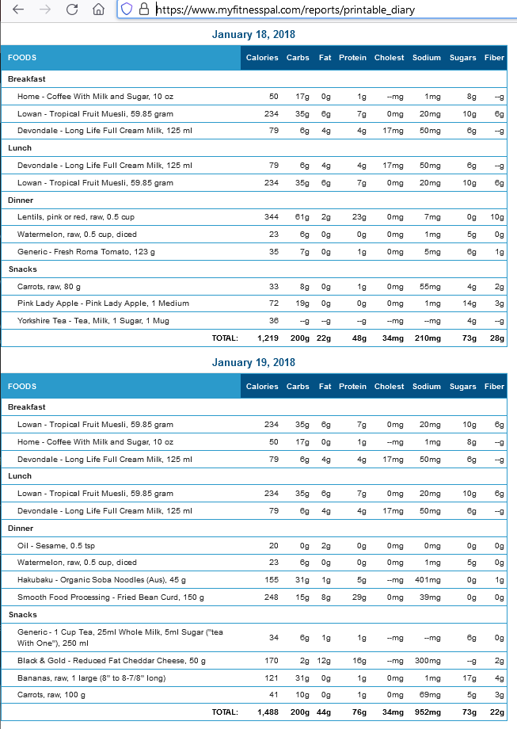
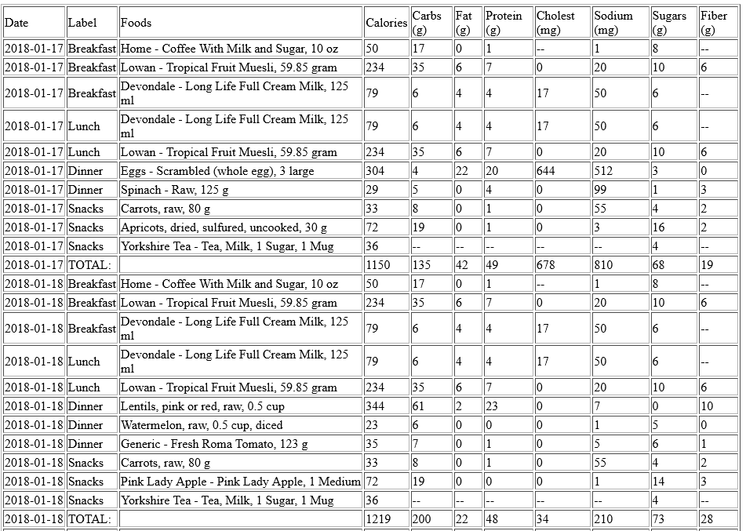

Export the MyFitnessPal printable diary
=======================================

Create another view of the MyFitnessPal printable diary, if that diary is publicly viewable. This app displays an html table containing the diary info. It won't export weight/other measurements, but works with the printable diary (food, exercise, notes), which must be public. 

You can try it out at https://myfitnesspal-diary.glitch.me/

### Convert From this:


### Convert To this:


Quick Start
===========
Host it yourself:

Clone the repository and cd into the directory containing the package.json file.

Install the dependencies:

```
$ npm install
```

Start the app:

```
$ npm start
```

View the website at: [http://localhost:8081](http://localhost:8081)